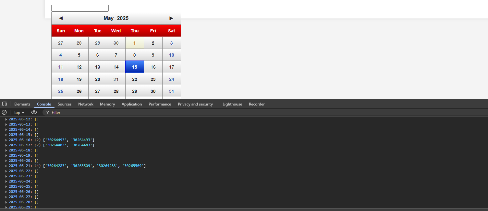
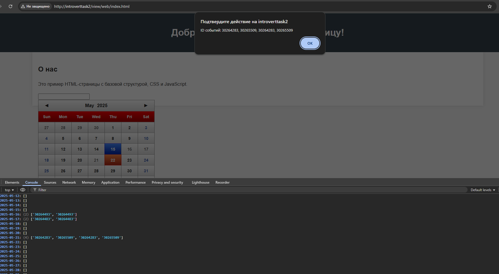
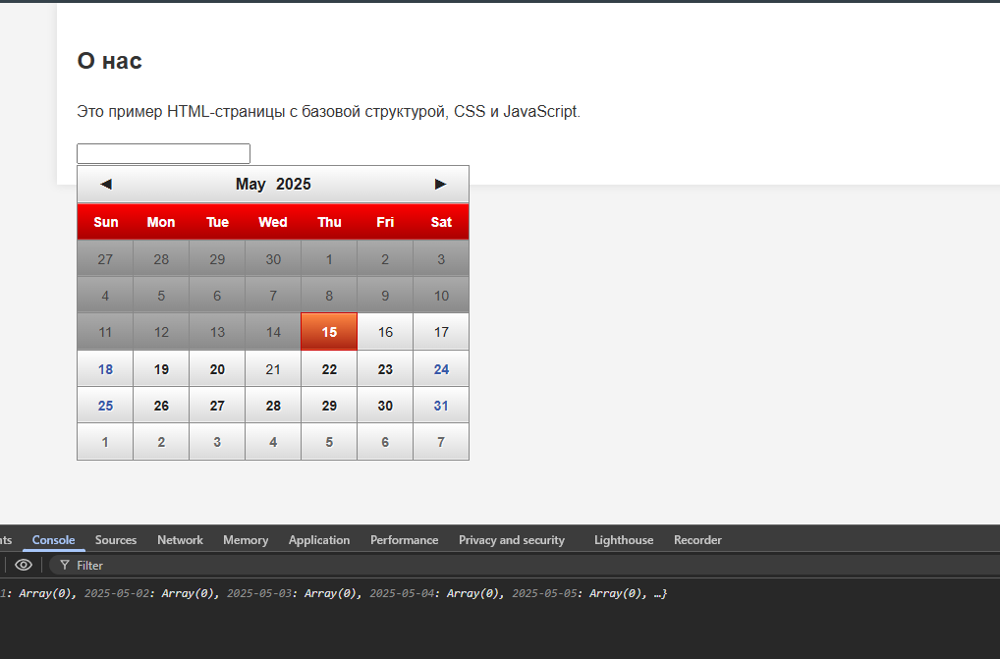

### Тестовая  задача 2:

### Запуск скрипта

```php
 $data=new \IntrovertTest\IntrovertApi('testDate2','2025-05-15',[24374824,57202302,247654035]);
var_dump($data->$data->returnJsonData());
```
## Зависимости проекта
Основные используемые пакеты:
- [Introvert SDK](https://bitbucket.org/mahatmaguru/intr-sdk-test) - для работы с API
- [glDatePicker]([https://bitbucket.org/mahatmaguru/intr-sdk-test](https://github.com/glad/glDatePicker/blob/gh-pages/assets/js/examples.js)) - datePicker 

## Результат скрипта




## Установка в docker
   ```docker 
   docker-compose up -d
   ```
